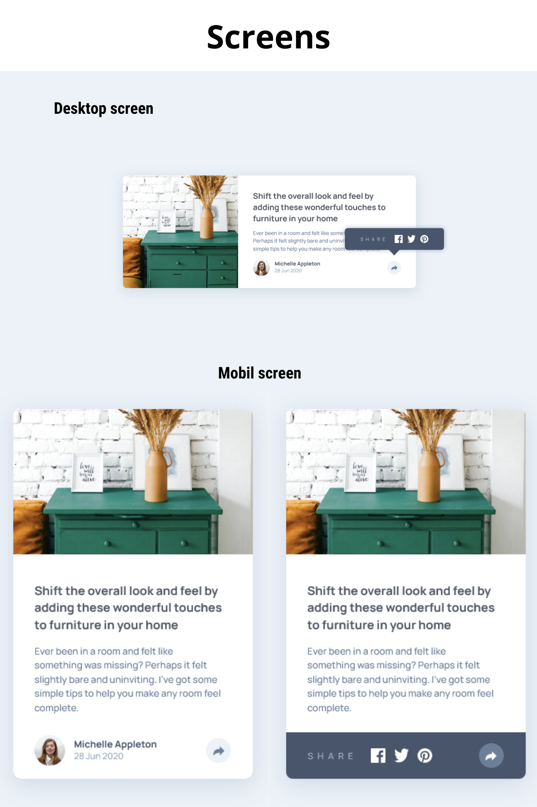

# Article preview component 

This is my solution to the Article preview component challenge on Frontend Mentor

## Table of contents

- [Overview](#overview)
  - [The challenge](#the-challenge)
  - [Screenshot](#screenshot)
  - [Links](#links)
- [My process](#my-process)
  - [Built with](#built-with)
- [Author](#author)

## Overview

### The challenge

Users should be able to:

- View the optimal layout for the component depending on their device's screen size
- See the social media share links when they click the share icon

### Screenshot

### Links

- Solution URL: [Add solution URL here](https://your-solution-url.com)
- Live Site URL: [https://oppahero.github.io/article-preview-component/](https://oppahero.github.io/article-preview-component/)

## My process

### Built with

- Semantic HTML5 markup
- CSS custom properties
- Flexbox
- Vanilla JavaScript
- Mobile-first workflow
- BEM Notation

#### CSS Specificity Graph

## Author

- Frontend Mentor - [@oppahero](https://www.frontendmentor.io/profile/oppahero)
